> Oscar Perianayagassamy, M2 IASD App., Université Paris-Dauphine

# Lunar Lander : Analyse comparative DQN, A2C & PPO sur différents taux d'apprentissage

Ce projet étudie l'impact des **Learning Rates** sur la convergence des algorithmes de DeepRL : `DQN`, `A2C` et `PPO`. Ces algorithmes sont entrainés sur 6 variantes du problème `Lunar Lander` : 
- Environnement d'actions discret : variante classique (sans modification des arguments par défaut de `Gymnasium`), variante venteuse et variante zéro-gravité venteuse.
- Environnement d'actions continue : variante classique, variante venteuse et variante zéro-gravité venteuse.

Tous les détails se trouvent dans le fichier <a href="rapport.pdf">rapport.pdf</a>.

## Quelques exemples de PPO 
Voici les performances de nos agents sur la variante **Windy Continuous**.

### `PPO` / actions discrètes (`VANILLA`) 

version `CLASSIC`

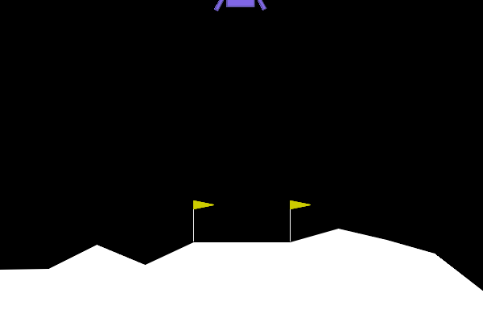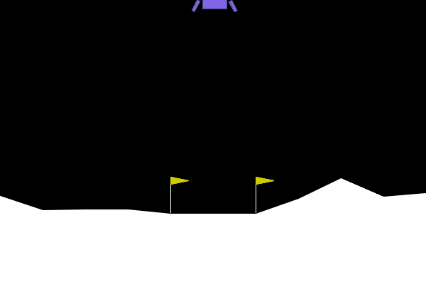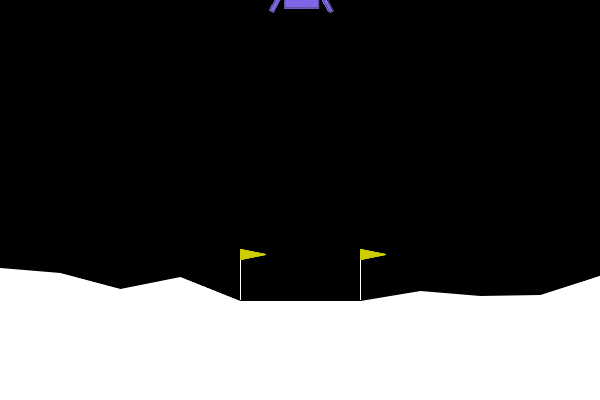

version `WINDY`

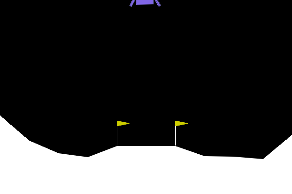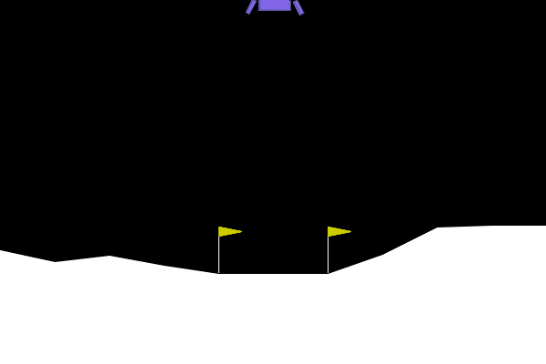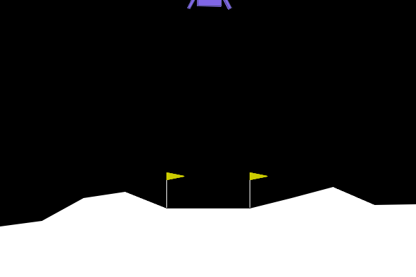

version `ZERO-GRAVITY-WINDY`

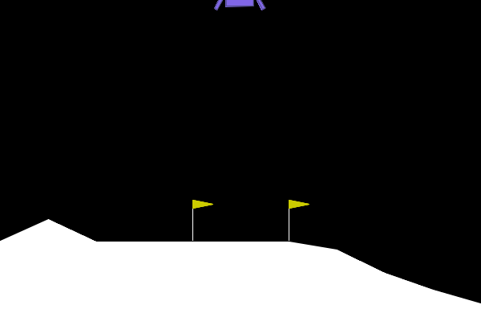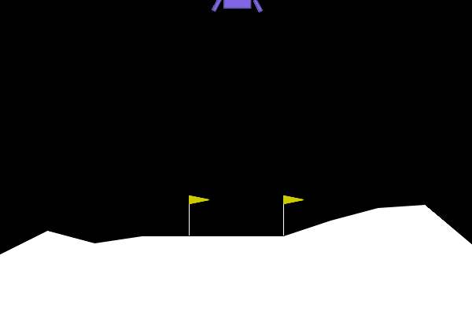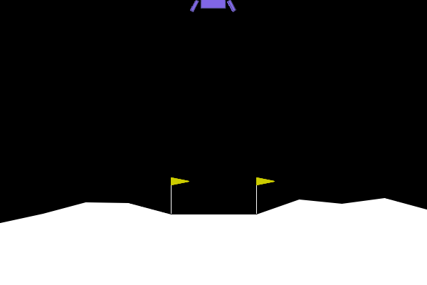

### `PPO` / actions continues (`CONTINUOUS`) 

version `CLASSIC`

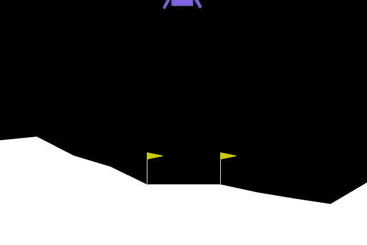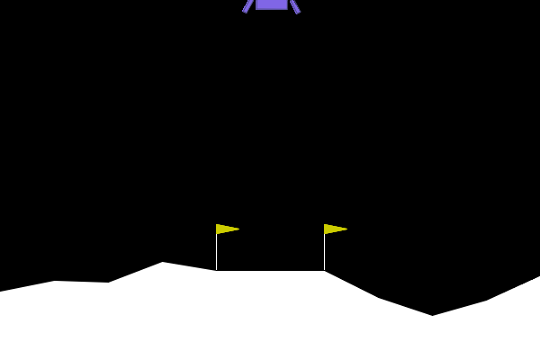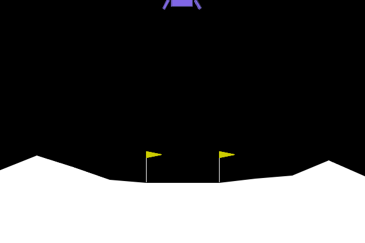

version `WINDY`

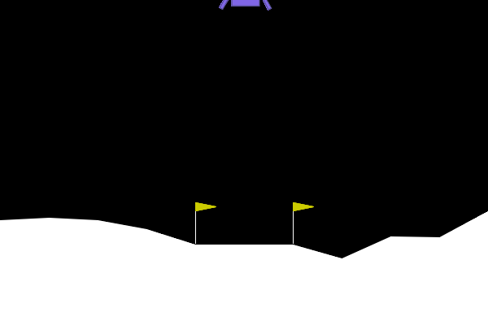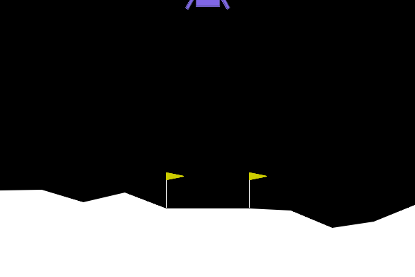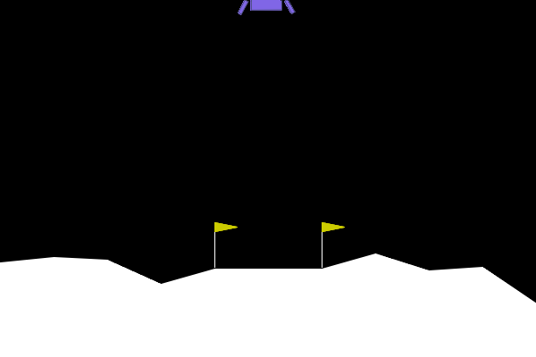

version `ZERO-GRAVITY-WINDY`

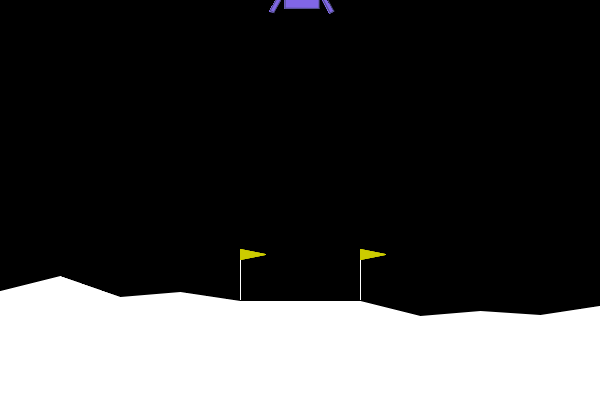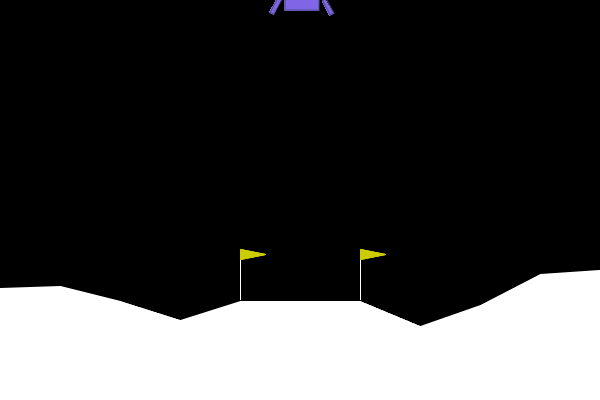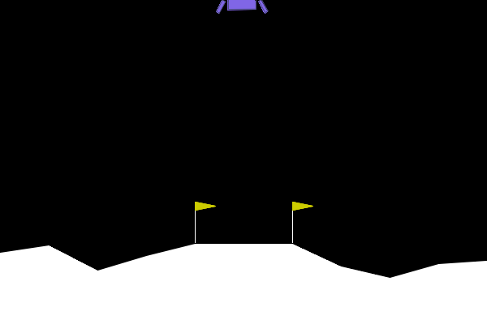


## 2. Protocole Expérimental
Nous avons testé 5 Learning Rates sur une échelle logarithmique : 
$\sim 10^{-7}, 10^{-6}, 10^{-4}, 10^{-3}, 10^{-2}$.


## 3. Installation
Le projet a été développé sous `Python3.13`.

```bash
git clone [https://github.com/operiana/Reinforcement-Learning-Project-Lunar-Lander-Analysis.git](https://github.com/operiana/Reinforcement-Learning-Project-Lunar-Lander-Analysis.git)
pip install -r requirements.txt